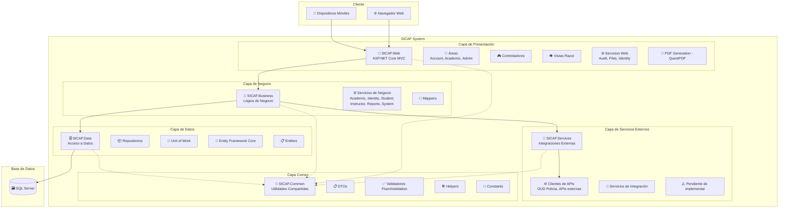
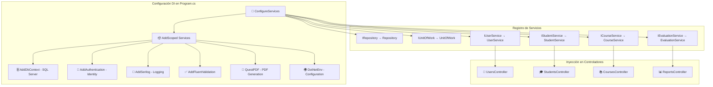
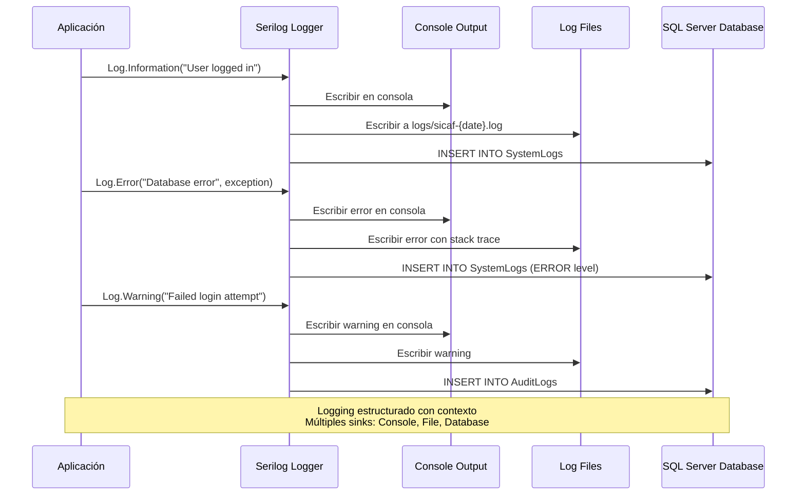
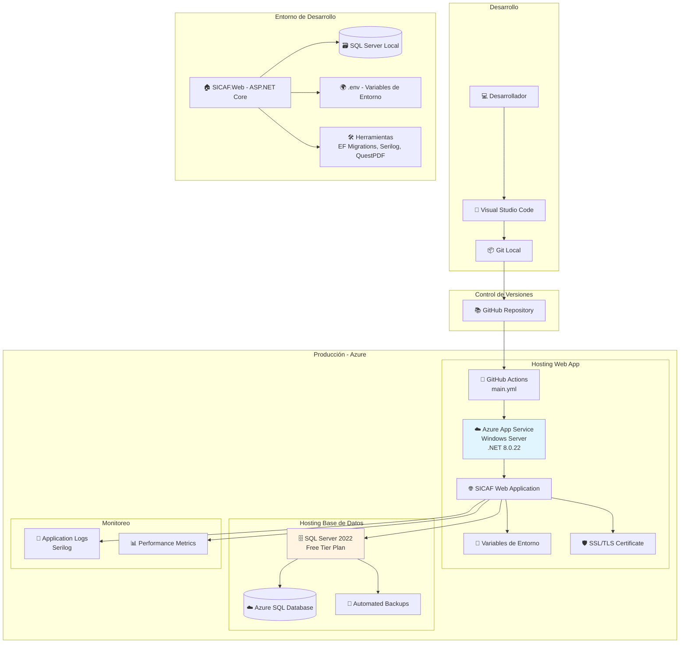
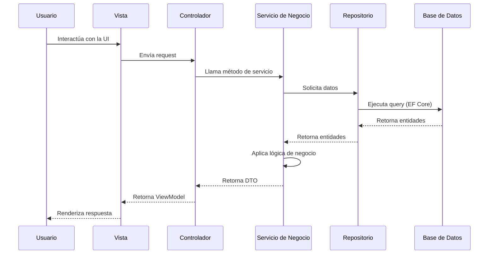

# SICAF - Architecture Documentation

## Introducción

Este documento describe la arquitectura del Sistema de Información para la Calificación de Fases de Vuelo (SICAF), proyecto Web de la Escuela de Aviación Policial - Policía Nacional de Colombia, desarrollado en ASP.NET Core 8.0 con una arquitectura de cinco capas que permite la gestión integral del programa académico de Especialización Piloto Policial.

## Arquitectura General del Sistema

### Arquitectura de Cinco Capas




## Dependency Injection



## Flujo de Logging con Serilog



## Despliegue y Infraestructura



## Estructura de Carpetas por Capa

### SICAF.Web (Capa de Presentación)
```
SICAF.Web/
├── Areas/              # Áreas de la aplicación (Academic, Admin, Account)
├── Controllers/        # Controladores MVC
├── Views/             # Vistas Razor
├── ViewComponents/    # Componentes de vista reutilizables
├── Services/          # Servicios específicos de la capa web
│   ├── Audit/        # Servicios de auditoría
│   ├── Files/        # Manejo de archivos
│   └── Identity/     # Servicios de identidad web
├── Middlewares/      # Middlewares personalizados
├── Models/           # ViewModels
├── wwwroot/          # Archivos estáticos (CSS, JS, imágenes)
└── Logs/             # Logs de la aplicación (Serilog)
```

### SICAF.Business (Capa de Negocio)
```
SICAF.Business/
├── Services/         # Servicios de negocio por dominio
│   ├── Academic/    # Gestión académica
│   ├── Identity/    # Gestión de usuarios y roles
│   ├── Student/     # Gestión de estudiantes
│   ├── Instructor/  # Gestión de instructores
│   ├── Reports/     # Generación de reportes
│   ├── System/      # Servicios del sistema
│   ├── Auditing/    # Auditoría de negocio
│   ├── Catalogs/    # Gestión de catálogos
│   └── Logging/     # Logging de negocio
├── Interfaces/      # Interfaces de servicios
└── Mappers/         # Mapeo entre DTOs y Entities
```

### SICAF.Data (Capa de Datos)
```
SICAF.Data/
├── Context/          # DbContext de Entity Framework
├── Entities/         # Entidades de la base de datos
├── Repositories/     # Implementación de repositorios
├── Interfaces/       # Interfaces de repositorios
├── Configuration/    # Configuración de entidades (Fluent API)
├── Migrations/       # Migraciones de EF Core
└── Initialization/   # Seeders e inicialización de datos
```

### SICAF.Services (Capa de Servicios Externos)
```
SICAF.Services/
├── External/         # Servicios de integración con APIs externas
│   ├── OUD/         # Integración con OUD Policía (pendiente)
│   ├── PoliceAPI/   # APIs de Policía Nacional (pendiente)
│   └── ThirdParty/  # Servicios de terceros (pendiente)
├── Clients/         # Clientes HTTP para APIs
├── Interfaces/      # Interfaces de servicios externos
├── Models/          # Modelos específicos de integraciones
└── Configuration/   # Configuración de servicios externos

Nota: Esta capa está preparada pero sin lógica implementada.
      Se usará para futuras integraciones con sistemas externos.
```

### SICAF.Common (Capa Común)
```
SICAF.Common/
├── DTOs/             # Data Transfer Objects
├── Validators/       # Validadores FluentValidation
├── Helpers/          # Clases auxiliares
├── Constants/        # Constantes del sistema
├── Models/           # Modelos compartidos
├── Interfaces/       # Interfaces compartidas
├── Configuration/    # Clases de configuración
└── Security/         # Utilidades de seguridad
```

## Tecnologías y Paquetes Principales

### SICAF.Web
- **ASP.NET Core 8.0 MVC** - Framework web principal (.NET 8.0.22)
- **Serilog.AspNetCore 8.0.3** - Logging estructurado
- **QuestPDF 2025.7.4** - Generación de reportes PDF en la capa web
- **ScottPlot 5.1.57** - Generación de gráficos en el servidor (backend)
- **DotNetEnv 3.1.1** - Gestión de variables de entorno
- **Entity Framework Core Tools 8.0.18** - Herramientas para migraciones

#### Frontend
- **Framework CSS**: Bootstrap 5
- **JavaScript**: Vanilla JavaScript con ES Modules
- **Librerías JavaScript**: jQuery (para DataTables y select2)
- **DataTables**: Tablas interactivas con búsqueda, paginación y filtrado
- **Select2**: Selectores mejorados con búsqueda
- **ApexCharts**: Gráficos y visualizaciones interactivas en el cliente

### SICAF.Data
- **Entity Framework Core 8.0.18** - ORM para acceso a datos
- **Microsoft.EntityFrameworkCore.SqlServer 8.0.18** - Provider de SQL Server
- **Microsoft.Extensions.Configuration 8.0.0** - Sistema de configuración
- **Microsoft.Extensions.Configuration.Json 8.0.1** - Configuración JSON
- **Microsoft.Extensions.Configuration.EnvironmentVariables 8.0.0** - Variables de entorno

### SICAF.Common
- **FluentValidation 12.0.0** - Validaciones de modelos
- **Microsoft.Extensions.DependencyInjection 8.0.1** - Inyección de dependencias
- **Microsoft.Extensions.Options 8.0.2** - Patrón de opciones para configuración
- **Microsoft.Extensions.Options.ConfigurationExtensions 8.0.0** - Extensiones de configuración
- **Microsoft.Extensions.Options.DataAnnotations 8.0.0** - Validaciones con anotaciones

### SICAF.Business
- Lógica de negocio organizada por dominios
- Servicios de negocio sin dependencias externas
- Referencias a Data y Common

### SICAF.Services
- **Propósito**: Futura conexión con servicios externos
- **Integraciones planeadas**:
  - OUD Policía (Sistema de autenticación policial)
  - APIs de Policía Nacional
  - Servicios de terceros
- **Estado actual**: Sin lógica implementada (preparado para futuras integraciones)

## Patrones de Diseño Implementados

1. **Repository Pattern** - Abstracción del acceso a datos
2. **Unit of Work** - Gestión de transacciones
3. **Dependency Injection** - Inversión de control
4. **Options Pattern** - Configuración fuertemente tipada
5. **MVC Pattern** - Separación de responsabilidades en la capa de presentación
6. **Service Layer** - Lógica de negocio centralizada por dominios
7. **DTO Pattern** - Transferencia de datos entre capas
8. **Mapper Pattern** - Mapeo entre entidades y DTOs

## Flujo de Datos Típico



## Consideraciones de Seguridad

1. **Autenticación y Autorización** - ASP.NET Core Identity con claims personalizados
2. **Validación de Datos** - FluentValidation en todas las capas
3. **Variables de Entorno** - Credenciales sensibles en .env (no versionadas)
4. **Logging y Auditoría** - Registro de acciones críticas con Serilog
5. **SQL Injection Prevention** - Entity Framework Core con queries parametrizadas
6. **XSS Protection** - Razor Views con encoding automático
7. **HTTPS** - SSL/TLS en producción

## Instalación de Paquetes NuGet

### SICAF.Data
```bash
# Paquetes de Entity Framework Core para EF y SQL Server
dotnet add src/SICAF.Data/SICAF.Data.csproj package Microsoft.EntityFrameworkCore --version 8.0.18
dotnet add src/SICAF.Data/SICAF.Data.csproj package Microsoft.EntityFrameworkCore.SqlServer --version 8.0.18

# Paquetes de Entity Framework Core para migraciones y SicafDbContextFactory
dotnet add src/SICAF.Data/SICAF.Data.csproj package Microsoft.Extensions.Configuration --version 8.0.0
dotnet add src/SICAF.Data/SICAF.Data.csproj package Microsoft.Extensions.Configuration.FileExtensions --version 8.0.1
dotnet add src/SICAF.Data/SICAF.Data.csproj package Microsoft.Extensions.Configuration.Json --version 8.0.1
dotnet add src/SICAF.Data/SICAF.Data.csproj package Microsoft.Extensions.Configuration.EnvironmentVariables --version 8.0.0
```

### SICAF.Web
```bash
# Entity Framework para migraciones
dotnet add src/SICAF.Web/SICAF.Web.csproj package Microsoft.EntityFrameworkCore.Tools --version 8.0.18

# DotNetEnv para variables de entorno (cargar Env.Load() antes de var builder = WebApplication.CreateBuilder(args))
dotnet add src/SICAF.Web/SICAF.Web.csproj package DotNetEnv --version 3.1.1

# Serilog para logging
dotnet add src/SICAF.Web/SICAF.Web.csproj package Serilog.AspNetCore --version 8.0.3

# QuestPDF para generación de PDFs con código C#
dotnet add src/SICAF.Web/SICAF.Web.csproj package QuestPDF --version 2025.7.4

# ScottPlot para generación de gráficos en el servidor (backend)
dotnet add src/SICAF.Web/SICAF.Web.csproj package ScottPlot --version 5.1.57
```

### SICAF.Common
```bash
# Microsoft.Extensions.DependencyInjection para inyección de dependencias
dotnet add src/SICAF.Common/SICAF.Common.csproj package Microsoft.Extensions.DependencyInjection --version 8.0.1

# Microsoft.Extensions.Options para configuración: patrón de opciones
dotnet add src/SICAF.Common/SICAF.Common.csproj package Microsoft.Extensions.Options --version 8.0.2
dotnet add src/SICAF.Common/SICAF.Common.csproj package Microsoft.Extensions.Options.ConfigurationExtensions --version 8.0.0
dotnet add src/SICAF.Common/SICAF.Common.csproj package Microsoft.Extensions.Options.DataAnnotations --version 8.0.0

# FluentValidation para validaciones
dotnet add src/SICAF.Common/SICAF.Common.csproj package FluentValidation --version 12.0.0
```

## Stack Tecnológico Completo

### Backend
- **Framework**: ASP.NET Core 8.0 MVC (.NET 8.0.22)
- **Lenguaje**: C# 12
- **ORM**: Entity Framework Core 8.0.18
- **Logging**: Serilog.AspNetCore 8.0.3
- **Validaciones**: FluentValidation 12.0.0
- **Generación de PDFs**: QuestPDF 2025.7.4
- **Generación de Gráficos (Server)**: ScottPlot 5.1.57
- **Configuración**: DotNetEnv 3.1.1

### Frontend
- **Framework CSS**: Bootstrap 5
- **JavaScript**: Vanilla JavaScript con ES Modules
- **Librerías JavaScript**:
  - jQuery (para DataTables y Select2)
  - DataTables (tablas interactivas)
  - Select2 (selectores mejorados)
  - ApexCharts (gráficos y visualizaciones)
- **Template Engine**: Razor Views

### Base de Datos
- **Producción**: Azure SQL Database (SQL Server 2022) - Free Tier
- **Desarrollo**: SQL Server LocalDB / SQL Server Express / SQL Server Developer
- **Proveedor EF**: Microsoft.EntityFrameworkCore.SqlServer 8.0.18
- **Migraciones**: Entity Framework Core Migrations

### Autenticación y Seguridad
- **Identity**: ASP.NET Core Identity
- **Autorización**: Claims-based Authorization
- **Protección**: HTTPS/SSL, CSRF Protection, XSS Protection

### Infraestructura y DevOps
- **Hosting**: Azure App Service (Windows Server)
- **CI/CD**: GitHub Actions (workflow: main.yml)
- **Control de versiones**: Git + GitHub
- **Rama de producción**: main
- **Sistema Operativo Producción**: Windows Server (Microsoft Windows 10.0.20348)
- **Runtime Producción**: .NET 8.0.22

### Herramientas de Desarrollo
- **IDE**: Visual Studio Code / Visual Studio 2022
- **Package Manager**: NuGet
- **Build Tool**: .NET CLI (dotnet)
- **Database Tools**: SQL Server Management Studio (SSMS) / Azure Data Studio

### Monitoreo y Logging
- **Application Logs**: Serilog (Console, File, Database)
- **Métricas**: Azure App Service Diagnostics (básico)
- **Log Files**: logs/sicaf-{date}.log

### Información del Proyecto
- **Versión actual**: 1.0.0
- **Última fecha de build**: 2025-11-20
- **Arquitectura**: 5 capas (Web, Business, Data, Services, Common)

