# SICAF - Guía de Despliegue

## Introducción

Este documento describe el proceso de despliegue de SICAF (Sistema de Información para la Calificación de Fases de Vuelo) en producción utilizando Azure App Service y GitHub Actions.

## Entorno de Producción

### Infraestructura Azure

```mermaid
graph TB
    subgraph "GitHub"
        Repo[📦 Repository]
        Actions[⚙️ GitHub Actions<br/>main.yml]
    end

    subgraph "Azure Cloud"
        subgraph "App Service"
            WebApp[🌐 SICAF Web App<br/>Windows Server<br/>.NET 8.0.22]
            AppSettings[⚙️ Configuration<br/>Environment Variables]
        end

        subgraph "Database"
            AzureSQL[(🗄️ Azure SQL Database<br/>SQL Server 2022<br/>Free Tier)]
        end

        subgraph "Monitoring"
            Logs[📝 Application Logs<br/>Serilog]
            Diagnostics[🔍 Azure Diagnostics]
        end
    end

    Repo --> Actions
    Actions -->|Deploy| WebApp
    WebApp --> AppSettings
    WebApp --> AzureSQL
    WebApp --> Logs
    WebApp --> Diagnostics
```



### Especificaciones Técnicas

- **Plataforma**: Azure App Service (Web App)
- **Sistema Operativo**: Windows Server (Microsoft Windows 10.0.20348)
- **Runtime**: .NET 8.0.22
- **Base de Datos**: Azure SQL Database (SQL Server 2022)
- **Plan de Base de Datos**: Free Tier (Flexible)
- **Rama de Producción**: `main`
- **Versión Actual**: 1.0.0
- **Último Build**: 2025-11-20

## CI/CD con GitHub Actions

### Workflow de Despliegue

El archivo de configuración se encuentra en `.github/workflows/main.yml`

```mermaid
sequenceDiagram
    participant Dev as Desarrollador
    participant Git as GitHub Repository
    participant Actions as GitHub Actions
    participant Build as Build Process
    participant Azure as Azure App Service
    participant DB as Azure SQL Database

    Dev->>Git: git push origin main
    Git->>Actions: Trigger workflow (main.yml)
    Actions->>Build: Checkout code
    Build->>Build: Restore dependencies
    Build->>Build: Build solution (.NET 8.0.22)
    Build->>Build: Run tests (si existen)
    Build->>Build: Publish artifacts
    Build->>Azure: Deploy to App Service
    Azure->>Azure: Restart application
    Azure->>DB: Test connection
    Azure->>Actions: Deployment success ✅
    Actions->>Git: Update deployment status
```



### Proceso de Build

1. **Trigger**: Push a la rama `main`
2. **Checkout**: Descarga el código del repositorio
3. **Restore**: Restaura los paquetes NuGet
4. **Build**: Compila la solución en modo Release
5. **Publish**: Genera los artefactos de publicación
6. **Deploy**: Despliega en Azure App Service

### Variables de Entorno en Azure

Las siguientes variables deben estar configuradas en Azure App Service:

```bash
# Base de datos
DB_CONNECTION_STRING=Server=tcp:...;Database=...;User ID=...;Password=...

# Configuración de la aplicación
ASPNETCORE_ENVIRONMENT=Production
ASPNETCORE_HTTPS_PORT=443

# Configuraciones de Usuario Administrador
AdminSettings__Username=123456789
AdminSettings__Password=123456789
AdminSettings__Name=YEISON
AdminSettings__LastName=MURILLO
AdminSettings__DocumentType=CC
AdminSettings__IdentificationNumber=123456789
AdminSettings__PhoneNumber=+57(310)3897-000
AdminSettings__Grade=TE
AdminSettings__Nationality=COL
AdminSettings__BloodType=O+
AdminSettings__BirthDate=01-01-1990
AdminSettings__Force=PONAL
```

## Proceso de Despliegue Manual

### Pre-requisitos

1. Cuenta de Azure con acceso al App Service
2. Azure CLI instalado
3. Acceso al repositorio de GitHub
4. Credenciales de la base de datos

### Pasos para Despliegue Manual

1. **Compilar la aplicación**:
```bash
cd src/SICAF.Web
dotnet publish -c Release -o ./publish
```

2. **Crear el paquete de despliegue**:
```bash
cd publish
zip -r sicaf-deploy.zip *
```

3. **Desplegar usando Azure CLI**:
```bash
az login
az webapp deployment source config-zip \
  --resource-group <resource-group-name> \
  --name <app-service-name> \
  --src sicaf-deploy.zip
```

4. **Verificar el despliegue**:
```bash
az webapp browse --name <app-service-name> --resource-group <resource-group-name>
```

## Migraciones de Base de Datos

### Aplicar Migraciones en Producción

**⚠️ IMPORTANTE**: Siempre hacer un backup antes de aplicar migraciones en producción.

1. **Backup de la base de datos**:
```bash
# Desde Azure Portal o usando Azure CLI
az sql db export \
  --resource-group <resource-group> \
  --server <server-name> \
  --name <database-name> \
  --admin-user <admin-user> \
  --admin-password <admin-password> \
  --storage-key <storage-key> \
  --storage-key-type StorageAccessKey \
  --storage-uri https://<storage-account>.blob.core.windows.net/<container>/backup-$(date +%Y%m%d).bacpac
```

2. **Aplicar migraciones**:
```bash
# Opción 1: Desde local (requiere acceso a la base de datos de producción)
dotnet ef database update --project src/SICAF.Data --startup-project src/SICAF.Web --connection "<production-connection-string>"

# Opción 2: Desde Azure Cloud Shell
# 1. Subir el proyecto a Cloud Shell
# 2. Ejecutar el comando de migración
```

3. **Verificar las migraciones**:
```sql
-- Conectarse a Azure SQL Database
SELECT * FROM __EFMigrationsHistory ORDER BY MigrationId DESC;
```

## Rollback

### En caso de problemas después del despliegue

1. **Rollback usando Azure Portal**:
   - Ir a App Service → Deployment Center
   - Seleccionar un despliegue anterior
   - Hacer clic en "Redeploy"

2. **Rollback de base de datos**:
```bash
# Restaurar desde backup
az sql db import \
  --resource-group <resource-group> \
  --server <server-name> \
  --name <database-name> \
  --admin-user <admin-user> \
  --admin-password <admin-password> \
  --storage-key <storage-key> \
  --storage-key-type StorageAccessKey \
  --storage-uri https://<storage-account>.blob.core.windows.net/<container>/backup-YYYYMMDD.bacpac
```

3. **Revertir migración específica**:
```bash
dotnet ef database update <previous-migration-name> \
  --project src/SICAF.Data \
  --startup-project src/SICAF.Web \
  --connection "<production-connection-string>"
```

## Monitoreo Post-Despliegue

### Verificaciones Post-Despliegue

1. **Health Check de la aplicación**:
   - Acceder a `https://<app-name>.azurewebsites.net/health`
   - Verificar que retorna HTTP 200

2. **Verificar logs en tiempo real**:
```bash
az webapp log tail --name <app-name> --resource-group <resource-group>
```

3. **Verificar conexión a la base de datos**:
   - Intentar login en la aplicación
   - Verificar que las consultas se ejecutan correctamente

4. **Revisar Application Insights** (si está configurado):
   - Verificar métricas de rendimiento
   - Revisar excepciones
   - Analizar tiempos de respuesta

### Logs y Diagnósticos

```mermaid
graph LR
    App[🌐 SICAF App] --> Serilog[📝 Serilog]
    Serilog --> Console[💻 Console Logs]
    Serilog --> File[📄 File Logs<br/>logs/sicaf-date.log]
    Serilog --> DB[(🗄️ Database<br/>SystemLogs table)]

    App --> Azure[☁️ Azure Diagnostics]
    Azure --> AppInsights[📊 Application Insights]
    Azure --> StreamLogs[🔄 Log Stream]
```



## Mejores Prácticas

### Pre-Despliegue

✅ **Hacer**:
- Crear una rama de release para testing
- Ejecutar todas las pruebas (cuando estén implementadas)
- Revisar los cambios en el código
- Hacer backup de la base de datos de producción
- Notificar a los usuarios sobre el mantenimiento

❌ **Evitar**:
- Desplegar directamente a producción sin testing
- Hacer cambios de esquema sin migración
- Desplegar durante horarios de alta actividad
- Omitir el backup de la base de datos

### Durante el Despliegue

✅ **Hacer**:
- Monitorear el proceso de despliegue
- Verificar los logs en tiempo real
- Tener el plan de rollback preparado

❌ **Evitar**:
- Hacer múltiples cambios simultáneos
- Modificar configuraciones manualmente durante el despliegue

### Post-Despliegue

✅ **Hacer**:
- Verificar funcionalidades críticas
- Monitorear métricas de rendimiento
- Revisar logs de errores
- Documentar cualquier problema encontrado

❌ **Evitar**:
- Asumir que el despliegue fue exitoso sin verificar
- Ignorar warnings en los logs

## Troubleshooting

### Problemas Comunes

1. **Error de conexión a la base de datos**:
   - Verificar la cadena de conexión en las variables de entorno
   - Verificar las reglas del firewall de Azure SQL
   - Verificar que el App Service tenga permisos

2. **Aplicación no inicia**:
   - Revisar los logs de Azure: `az webapp log tail`
   - Verificar que la versión de .NET sea correcta
   - Verificar las variables de entorno

3. **Errores 500**:
   - Habilitar detailed errors: `ASPNETCORE_ENVIRONMENT=Development` temporalmente
   - Revisar los logs de Serilog
   - Verificar las dependencias

4. **Performance lento**:
   - Revisar el plan de App Service (considerar escalar)
   - Verificar queries lentas en la base de datos
   - Considerar implementar caché

## Seguridad en Producción

### Checklist de Seguridad

- [ ] HTTPS habilitado (SSL/TLS)
- [ ] Variables sensibles en Azure Key Vault
- [ ] Firewall de base de datos configurado
- [ ] Autenticación y autorización implementadas
- [ ] Logging de acciones críticas habilitado
- [ ] Backup automático configurado
- [ ] Políticas de contraseñas fuertes
- [ ] Rate limiting implementado (si aplica)
- [ ] CORS configurado correctamente
- [ ] Headers de seguridad configurados

### Variables Sensibles

**NUNCA** incluir en el código fuente:
- Cadenas de conexión
- Claves API
- Secrets de JWT
- Contraseñas
- Tokens de acceso

**Usar siempre**:
- Variables de entorno en Azure App Service
- Azure Key Vault para secretos críticos
- Archivo `.env` en desarrollo (no versionado)

## Escalabilidad

### Opciones de Escalado

1. **Scale Up** (Vertical):
   - Aumentar el tamaño del App Service Plan
   - Más CPU y RAM

2. **Scale Out** (Horizontal):
   - Aumentar el número de instancias
   - Load balancing automático

3. **Database Scaling**:
   - Upgrade del plan de Azure SQL Database
   - Considerar read replicas para reporting

## Contacto y Soporte

Para problemas relacionados con el despliegue:
- **Repositorio**: GitHub - SICAF
- **Equipo de desarrollo**: [Gmail](mailto:alexanderardila03@gmail.com)
- **Soporte Azure**: Portal de Azure - Support

## Referencias

- [Azure App Service Documentation](https://docs.microsoft.com/azure/app-service/)
- [GitHub Actions Documentation](https://docs.github.com/actions)
- [Entity Framework Core Migrations](https://docs.microsoft.com/ef/core/managing-schemas/migrations/)
