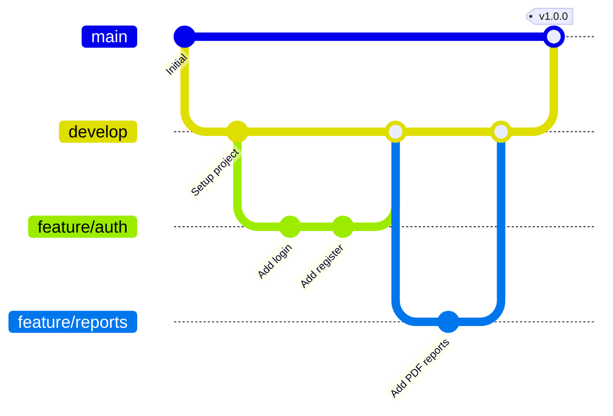

# SICAF - Guía de Desarrollo

## Introducción

Esta guía proporciona toda la información necesaria para configurar el entorno de desarrollo y contribuir al proyecto SICAF (Sistema de Información para la Calificación de Fases de Vuelo).

## Requisitos Previos

### Software Necesario

- **Git** - Control de versiones (v2.40+)
- **.NET SDK 8.0.22** - [Descargar](https://dotnet.microsoft.com/download/dotnet/8.0)
- **SQL Server** - LocalDB, Express o Developer Edition
  - SQL Server 2019+ recomendado
  - Puede usar Azure SQL Database para desarrollo
- **Editor de Código**:
  - Visual Studio 2022 (v17.8+) recomendado
  - Visual Studio Code con extensiones de C#
  - JetBrains Rider

### Herramientas Opcionales

- **SQL Server Management Studio (SSMS)** - Para administración de base de datos
- **Azure Data Studio** - Alternativa multiplataforma a SSMS
- **Postman** o **Insomnia** - Para pruebas de API
- **Git Extensions** o **GitKraken** - Interfaces gráficas para Git

## Configuración Inicial

### 1. Clonar el Repositorio

```bash
# Clonar el repositorio
git clone https://github.com/tu-organizacion/SICAF.git
cd SICAF

# Verificar la rama actual
git branch
```

### 2. Configurar Variables de Entorno

Crear un archivo `.env` en la raíz del proyecto:

```bash
# .env
# IMPORTANTE: Este archivo NO debe ser versionado en Git

# Base de Datos
ConnectionStrings__DefaultConnection=Server=(localdb)\\mssqllocaldb;Database=SicafDB;Trusted_Connection=True;MultipleActiveResultSets=true

# Configuración de la Aplicación
ASPNETCORE_ENVIRONMENT=Development
ASPNETCORE_HTTPS_PORT=5001

# Configuraciones de Usuario Administrador
AdminSettings__Username=123456789
AdminSettings__Password=123456789
AdminSettings__Name=YEISON
AdminSettings__LastName=MURILLO
AdminSettings__DocumentType=CC
AdminSettings__IdentificationNumber=123456789
AdminSettings__PhoneNumber=+57(310)3897-000
AdminSettings__Grade=TE
AdminSettings__Nationality=COL
AdminSettings__BloodType=O+
AdminSettings__BirthDate=01-01-1990
AdminSettings__Force=PONAL
```

### 3. Restaurar Dependencias

```bash
# Restaurar todos los paquetes NuGet
dotnet restore

# O restaurar por proyecto específico
cd src/SICAF.Web
dotnet restore
```

### 4. Configurar la Base de Datos

```bash
# Navegar al proyecto Web
cd src/SICAF.Web

# Aplicar las migraciones
dotnet ef database update --project ../SICAF.Data

# Verificar que la base de datos se creó correctamente
```

### 5. Compilar la Solución

```bash
# Desde la raíz del proyecto
dotnet build

# O compilar en modo Release
dotnet build -c Release
```

### 6. Ejecutar la Aplicación

```bash
# Desde src/SICAF.Web
dotnet run

# O con hot reload
dotnet watch run
```

La aplicación estará disponible en:
- HTTPS: `https://localhost:5001`
- HTTP: `http://localhost:5000`

## Estructura del Proyecto

```
SICAF/
├── .github/
│   └── workflows/
│       └── main.yml           # GitHub Actions CI/CD
├── src/
│   ├── SICAF.Web/             # Capa de Presentación (MVC)
│   ├── SICAF.Business/        # Capa de Negocio
│   ├── SICAF.Data/            # Capa de Datos (EF Core)
│   ├── SICAF.Common/          # DTOs, Validadores, Helpers
│   └── SICAF.Services/        # Servicios externos (futuro)
├── tests/                     # Pruebas unitarias e integración (pendiente)
├── docs/                      # Documentación
│   ├── ARCHITECTURE.md
│   ├── DEPLOYMENT.md
│   ├── DEVELOPMENT.md
│   ├── ROADMAP.md
│   └── SETUP.md
├── .env                       # Variables de entorno (no versionado)
├── .gitignore
├── SICAF.sln                  # Solución de Visual Studio
└── README.md
```

## Flujo de Trabajo de Desarrollo

### Branching Strategy



### Ramas Principales

- **`main`**: Rama de producción (protegida)
- **`develop`**: Rama de desarrollo principal
- **`feature/*`**: Nuevas funcionalidades
- **`bugfix/*`**: Correcciones de bugs
- **`hotfix/*`**: Correcciones urgentes en producción

### Proceso de Desarrollo

1. **Crear una rama desde develop**:
```bash
git checkout develop
git pull origin develop
git checkout -b feature/nueva-funcionalidad
```

2. **Desarrollar y hacer commits**:
```bash
git add .
git commit -m "feat: Agregar nueva funcionalidad X"
```

3. **Mantener la rama actualizada**:
```bash
git checkout develop
git pull origin develop
git checkout feature/nueva-funcionalidad
git rebase develop
```

4. **Push y crear Pull Request**:
```bash
git push origin feature/nueva-funcionalidad
# Crear PR en GitHub desde feature/nueva-funcionalidad hacia develop
```

### Convenciones de Commits

Seguimos [Conventional Commits](https://www.conventionalcommits.org/):

- `feat:` - Nueva funcionalidad
- `fix:` - Corrección de bug
- `docs:` - Cambios en documentación
- `style:` - Cambios de formato (sin afectar código)
- `refactor:` - Refactorización de código
- `test:` - Agregar o modificar pruebas
- `chore:` - Tareas de mantenimiento

**Ejemplos**:
```bash
git commit -m "feat: Agregar autenticación con Identity"
git commit -m "fix: Corregir error en cálculo de calificaciones"
git commit -m "docs: Actualizar README con instrucciones de instalación"
git commit -m "refactor: Mejorar estructura de servicios"
```

## Trabajo con Entity Framework Core

### Crear una Nueva Migración

```bash
cd src/SICAF.Web
dotnet ef migrations add NombreDeLaMigracion --project ../SICAF.Data
```

### Aplicar Migraciones

```bash
# Aplicar todas las migraciones pendientes
dotnet ef database update --project ../SICAF.Data

# Aplicar hasta una migración específica
dotnet ef database update NombreDeMigracion --project ../SICAF.Data

# Revertir todas las migraciones
dotnet ef database update 0 --project ../SICAF.Data
```

### Revertir una Migración

```bash
# Revertir la última migración (sin borrar el archivo)
dotnet ef database update MigracionAnterior --project ../SICAF.Data

# Eliminar el archivo de migración
dotnet ef migrations remove --project ../SICAF.Data
```

### Ver el SQL de una Migración

```bash
dotnet ef migrations script --project ../SICAF.Data
```

## Debugging

### Visual Studio

1. Establecer `SICAF.Web` como proyecto de inicio
2. Presionar F5 o clic en "Start Debugging"
3. Establecer breakpoints en el código

### Visual Studio Code

Agregar configuración en `.vscode/launch.json`:

```json
{
  "version": "0.2.0",
  "configurations": [
    {
      "name": ".NET Core Launch (web)",
      "type": "coreclr",
      "request": "launch",
      "preLaunchTask": "build",
      "program": "${workspaceFolder}/src/SICAF.Web/bin/Debug/net8.0/SICAF.Web.dll",
      "args": [],
      "cwd": "${workspaceFolder}/src/SICAF.Web",
      "stopAtEntry": false,
      "serverReadyAction": {
        "action": "openExternally",
        "pattern": "\\bNow listening on:\\s+(https?://\\S+)"
      },
      "env": {
        "ASPNETCORE_ENVIRONMENT": "Development"
      },
      "sourceFileMap": {
        "/Views": "${workspaceFolder}/Views"
      }
    }
  ]
}
```

## Testing (Pendiente de Implementación)

### Estructura de Pruebas Planeada

```
tests/
├── SICAF.UnitTests/           # Pruebas unitarias
│   ├── Business/
│   ├── Data/
│   └── Web/
├── SICAF.IntegrationTests/    # Pruebas de integración
│   ├── Controllers/
│   ├── Services/
│   └── Repositories/
└── SICAF.E2ETests/            # Pruebas end-to-end (futuro)
```

### Framework de Pruebas Recomendado

- **xUnit** - Framework de pruebas
- **Moq** - Mocking framework
- **FluentAssertions** - Assertions más legibles
- **Microsoft.AspNetCore.Mvc.Testing** - Pruebas de integración

### Comandos para Pruebas (cuando estén implementadas)

```bash
# Ejecutar todas las pruebas
dotnet test

# Ejecutar con coverage
dotnet test /p:CollectCoverage=true

# Ejecutar pruebas específicas
dotnet test --filter "FullyQualifiedName~SICAF.UnitTests.Business"
```

## Logging y Debugging

### Serilog

Los logs se guardan en:
- **Consola**: Output directo durante desarrollo
- **Archivos**: `logs/sicaf-YYYY-MM-DD.log`
- **Base de Datos**: Tabla `SystemLogs` (eventos importantes)

### Niveles de Log

```csharp
// En los servicios o controladores
using Microsoft.Extensions.Logging;

public class MiServicio
{
    private readonly ILogger<MiServicio> _logger;

    public MiServicio(ILogger<MiServicio> logger)
    {
        _logger = logger;
    }

    public void MiMetodo()
    {
        _logger.LogTrace("Mensaje de traza detallado");
        _logger.LogDebug("Información de debug");
        _logger.LogInformation("Información general");
        _logger.LogWarning("Advertencia");
        _logger.LogError("Error");
        _logger.LogCritical("Error crítico");
    }
}
```

## Paquetes y Dependencias

### Agregar un Nuevo Paquete

```bash
# Agregar a un proyecto específico
dotnet add src/SICAF.Web/SICAF.Web.csproj package NombreDelPaquete --version X.X.X

# Ver paquetes instalados
dotnet list src/SICAF.Web/SICAF.Web.csproj package

# Actualizar todos los paquetes
dotnet list package --outdated
```

### Paquetes Principales por Capa

Ver [ARCHITECTURE.md - Instalación de Paquetes NuGet](ARCHITECTURE.md#instalación-de-paquetes-nuget) o [SETUP.md](SETUP.md) para comandos completos

## Frontend Development

### Tecnologías Frontend

- **Bootstrap 5**: Framework CSS principal
- **Vanilla JavaScript**: ES Modules sin frameworks pesados
- **jQuery**: Solo para librerías específicas (DataTables, Select2)
- **ApexCharts**: Gráficos interactivos
- **DataTables**: Tablas con búsqueda y paginación
- **Select2**: Selectores con búsqueda

### Estructura de Assets

```
wwwroot/
├── css/
│   ├── site.css              # Estilos personalizados
│   └── lib/                  # Librerías CSS
├── js/
│   ├── site.js               # JavaScript principal
│   └── modules/              # Módulos ES6
└── lib/                      # Librerías de terceros
    ├── bootstrap/
    ├── jquery/
    ├── datatables/
    ├── select2/
    └── apexcharts/
```

### Ejemplo de Módulo JavaScript

```javascript
// wwwroot/js/modules/reports.js
export class ReportManager {
    constructor() {
        this.initCharts();
    }

    initCharts() {
        const options = {
            chart: { type: 'line' },
            series: [{ name: 'Calificaciones', data: [30, 40, 35, 50] }],
            xaxis: { categories: ['Fase 1', 'Fase 2', 'Fase 3', 'Fase 4'] }
        };

        const chart = new ApexCharts(document.querySelector("#chart"), options);
        chart.render();
    }
}
```

### Uso en Vistas Razor

```html
@section Scripts {
    <script type="module">
        import { ReportManager } from '/js/modules/reports.js';
        const manager = new ReportManager();
    </script>
}
```

## Generación de PDFs con QuestPDF

### Ejemplo Básico

```csharp
using QuestPDF.Fluent;
using QuestPDF.Helpers;

public class ReportPdfGenerator
{
    public byte[] GenerateReport(ReportData data)
    {
        return Document.Create(container =>
        {
            container.Page(page =>
            {
                page.Size(PageSizes.Letter);
                page.Margin(2, Unit.Centimetre);

                page.Header()
                    .Text("Reporte SICAF")
                    .SemiBold().FontSize(20).FontColor(Colors.Blue.Medium);

                page.Content()
                    .PaddingVertical(1, Unit.Centimetre)
                    .Column(column =>
                    {
                        column.Item().Text($"Estudiante: {data.StudentName}");
                        column.Item().Text($"Fase: {data.Phase}");
                        // Más contenido...
                    });

                page.Footer()
                    .AlignCenter()
                    .Text(x =>
                    {
                        x.Span("Página ");
                        x.CurrentPageNumber();
                    });
            });
        }).GeneratePdf();
    }
}
```

## Generación de Gráficos con ScottPlot

### Ejemplo de Gráfico en Backend

```csharp
using ScottPlot;

public class ChartGenerator
{
    public byte[] GeneratePerformanceChart(double[] scores, string[] phases)
    {
        var plt = new Plot();
        plt.Add.Scatter(Enumerable.Range(0, scores.Length).Select(i => (double)i).ToArray(), scores);
        plt.XAxis.Label("Fases");
        plt.YAxis.Label("Calificación");
        plt.Title("Rendimiento del Estudiante");

        return plt.GetImageBytes(800, 600);
    }
}
```

## Mejores Prácticas

### Código Limpio

1. **Nombres descriptivos**: Usar nombres claros y significativos
2. **Funciones pequeñas**: Una función debe hacer una sola cosa
3. **Comentarios**: Solo cuando sea necesario explicar el "por qué"
4. **DRY**: Don't Repeat Yourself
5. **SOLID**: Seguir los principios SOLID

### Seguridad

1. **Validación**: Validar TODAS las entradas del usuario
2. **Sanitización**: Limpiar datos antes de guardar
3. **Autorización**: Verificar permisos en cada acción
4. **Logging**: No loguear información sensible
5. **Secrets**: NUNCA versionar secrets o contraseñas

### Performance

1. **Async/Await**: Usar operaciones asíncronas para I/O
2. **Caché**: Cachear datos que no cambian frecuentemente
3. **Lazy Loading**: Cargar datos bajo demanda
4. **Índices**: Crear índices en base de datos para queries frecuentes
5. **Paginación**: Paginar resultados grandes

## Troubleshooting

### Problemas Comunes

**1. Error: "Unable to connect to database"**
```bash
# Verificar cadena de conexión en .env
# Verificar que SQL Server esté corriendo
# Para LocalDB:
sqllocaldb start mssqllocaldb
```

**2. Error: "Migration already applied"**
```bash
# Eliminar la base de datos y recrear
dotnet ef database drop --project src/SICAF.Data
dotnet ef database update --project src/SICAF.Data
```

**3. Error: "Package restore failed"**
```bash
# Limpiar cache de NuGet
dotnet nuget locals all --clear
dotnet restore
```

**4. Error: "Port already in use"**
```bash
# Cambiar el puerto en Properties/launchSettings.json
# O matar el proceso que usa el puerto
# Windows:
netstat -ano | findstr :5001
taskkill /PID <PID> /F
```

## Recursos Útiles

### Documentación Oficial

- [ASP.NET Core](https://docs.microsoft.com/aspnet/core)
- [Entity Framework Core](https://docs.microsoft.com/ef/core)
- [Serilog](https://serilog.net/)
- [QuestPDF](https://www.questpdf.com/)
- [ScottPlot](https://scottplot.net/)
- [Bootstrap 5](https://getbootstrap.com/)
- [ApexCharts](https://apexcharts.com/)

### Herramientas de Aprendizaje

- [Microsoft Learn](https://learn.microsoft.com/)
- [Pluralsight](https://www.pluralsight.com/)
- [.NET YouTube Channel](https://www.youtube.com/dotnet)

## Contacto

Para preguntas o soporte:
- **Issues**: GitHub Issues
- **Email**: [Gmail](mailto:alexanderardila03@gmail.com)
- **Documentación**: `docs/` folder

---

                                                                ¡Feliz desarrollo! 🚀
