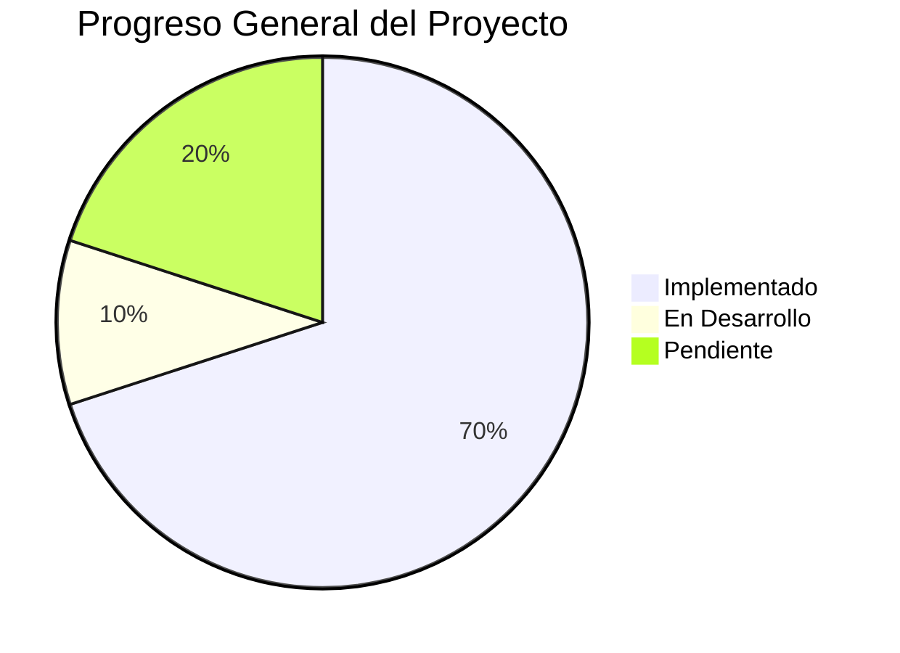

# SICAF - Roadmap y Tareas Pendientes

## Introducción

Este documento contiene el plan de desarrollo futuro, funcionalidades pendientes y mejoras planeadas para SICAF (Sistema de Información para la Calificación de Fases de Vuelo).

**Última actualización**: 2025-11-25
**Versión actual**: 1.0.0
**Próxima versión**: 1.1.0 (planeada)

## Estado del Proyecto



## Prioridades

- 🔴 **Crítico** - Debe hacerse lo antes posible
- 🟡 **Alto** - Importante para la siguiente versión
- 🟢 **Medio** - Deseable pero no urgente
- 🔵 **Bajo** - Mejora futura

---

## 1. Testing y Calidad de Código 🔴

### 1.1 Pruebas Unitarias - NO IMPLEMENTADAS

**Prioridad**: 🔴 Crítico
**Estado**: ❌ No iniciado
**Estimación**: 4-6 semanas

#### Tareas:

- [ ] Configurar proyecto de pruebas `SICAF.UnitTests`
- [ ] Instalar frameworks de testing:
  ```bash
  dotnet new xunit -n SICAF.UnitTests
  cd SICAF.UnitTests
  dotnet add package xUnit --version 2.6.6
  dotnet add package Moq --version 4.20.70
  dotnet add package FluentAssertions --version 6.12.0
  dotnet add package Microsoft.EntityFrameworkCore.InMemory --version 8.0.18
  ```

#### Áreas a testear:

**SICAF.Business**:
- [ ] `UserService` - Gestión de usuarios
- [ ] `StudentService` - Gestión de estudiantes
- [ ] `InstructorService` - Gestión de instructores
- [ ] `CourseService` - Gestión de cursos
- [ ] `PhaseService` - Gestión de fases
- [ ] `MissionService` - Gestión de misiones
- [ ] `EvaluationService` - Lógica de evaluaciones
- [ ] `ReportService` - Generación de reportes
- [ ] `AuditService` - Auditoría de acciones

**SICAF.Data**:
- [ ] `Repository<T>` - Operaciones CRUD genéricas
- [ ] `UnitOfWork` - Gestión de transacciones
- [ ] Repositorios específicos por entidad

**SICAF.Common**:
- [ ] Validadores FluentValidation
- [ ] Helpers y utilidades
- [ ] Mappers de DTOs

**Target de cobertura**: 80% mínimo

### 1.2 Pruebas de Integración

**Prioridad**: 🟡 Alto
**Estado**: ❌ No iniciado
**Estimación**: 3-4 semanas

- [ ] Configurar proyecto `SICAF.IntegrationTests`
- [ ] Instalar `Microsoft.AspNetCore.Mvc.Testing`
- [ ] Configurar TestServer con base de datos en memoria
- [ ] Pruebas de controladores:
  - [ ] `AccountController` - Login, registro, perfiles
  - [ ] `StudentsController` - CRUD de estudiantes
  - [ ] `InstructorsController` - CRUD de instructores
  - [ ] `CoursesController` - CRUD de cursos
  - [ ] `PhasesController` - Gestión de fases
  - [ ] `MissionsController` - Evaluación de misiones
  - [ ] `ReportsController` - Generación de reportes
- [ ] Pruebas de flujos completos (E2E):
  - [ ] Flujo de registro y autenticación
  - [ ] Flujo de evaluación de estudiante
  - [ ] Flujo de generación de reportes

### 1.3 Code Quality

**Prioridad**: 🟡 Alto
**Estado**: ⚠️ Parcial

- [ ] Configurar **SonarQube** o **SonarCloud** para análisis estático
- [ ] Configurar **StyleCop** para estándares de código
- [ ] Implementar **EditorConfig** para consistencia
- [ ] Configurar **Code Coverage** en CI/CD
- [ ] Implementar **pre-commit hooks** con Husky.NET

```bash
# Instalar herramientas
dotnet tool install --global dotnet-sonarscanner
dotnet tool install --global dotnet-coverage
```

---

## 2. Documentación 🟡

### 2.1 Documentación Técnica

**Prioridad**: 🟡 Alto
**Estado**: ⚠️ Parcial

- [x] ~~ARCHITECTURE.md~~ ✅ Completado
- [x] ~~DEPLOYMENT.md~~ ✅ Completado
- [x] ~~DEVELOPMENT.md~~ ✅ Completado
- [x] ~~ROADMAP.md~~ ✅ Completado (este documento)
- [x] ~~SETUP.md~~ ✅ Completado
- [ ] **DATABASE.md** - Esquema de base de datos
  - [ ] Diagrama ER completo
  - [ ] Descripción de tablas
  - [ ] Relaciones entre entidades
  - [ ] Índices y optimizaciones
  - [ ] Stored procedures (si hay)
- [ ] **API.md** - Documentación de endpoints (si hay API REST)
  - [ ] Endpoints disponibles
  - [ ] Métodos HTTP
  - [ ] Parámetros y respuestas
  - [ ] Ejemplos de uso
  - [ ] Códigos de error
- [ ] **SECURITY.md** - Guía de seguridad
  - [ ] Políticas de seguridad
  - [ ] Reporte de vulnerabilidades
  - [ ] Mejores prácticas
  - [ ] Auditoría de seguridad

### 2.2 Documentación de Usuario

**Prioridad**: 🟢 Medio
**Estado**: ❌ No iniciado

- [ ] **USER_GUIDE.md** - Manual de usuario
  - [ ] Guía para estudiantes
  - [ ] Guía para instructores
  - [ ] Guía para administradores
  - [ ] Guía para directivos
- [ ] **FAQ.md** - Preguntas frecuentes
- [ ] **CHANGELOG.md** - Historial de cambios por versión
- [ ] Videos tutoriales (opcional)

### 2.3 Documentación de Código

**Prioridad**: 🟢 Medio
**Estado**: ⚠️ Parcial

- [ ] Agregar XML documentation comments en clases públicas
- [ ] Generar documentación con **DocFX** o **Sandcastle**
- [ ] Documentar decisiones arquitectónicas (ADRs)

---

## 3. Performance y Optimización 🟡

### 3.1 Optimización de Base de Datos

**Prioridad**: 🟡 Alto
**Estado**: ❌ No iniciado

- [ ] Análisis de queries lentas
- [ ] Crear índices en columnas frecuentemente consultadas
- [ ] Implementar query store en Azure SQL
- [ ] Optimizar queries N+1 con `.Include()` o projections
- [ ] Considerar vistas materializadas para reportes complejos
- [ ] Implementar paginación en todas las listas grandes

### 3.2 Caché

**Prioridad**: 🟡 Alto
**Estado**: ❌ No iniciado

- [ ] Implementar **Memory Cache** para datos estáticos
  - [ ] Catálogos (tipos de misión, rangos, etc.)
  - [ ] Configuraciones del sistema
  - [ ] Datos de referencia
- [ ] Considerar **Distributed Cache** con Redis (futuro)
- [ ] Implementar **Response Caching** para endpoints públicos
- [ ] Estrategia de invalidación de caché

```csharp
// Ejemplo de implementación
services.AddMemoryCache();
services.AddDistributedMemoryCache(); // O Redis en producción
```

### 3.3 Optimización Frontend

**Prioridad**: 🟢 Medio
**Estado**: ⚠️ Parcial

- [ ] Minificación de CSS y JavaScript
- [ ] Bundling de assets
- [ ] Lazy loading de imágenes
- [ ] Comprimir imágenes
- [ ] Implementar CDN para assets estáticos
- [ ] Optimizar carga de librerías (considerar tree-shaking)

### 3.4 Monitoreo de Performance

**Prioridad**: 🟡 Alto
**Estado**: ❌ No iniciado

- [ ] Implementar **Application Insights** en Azure
- [ ] Configurar alertas de performance
- [ ] Dashboard de métricas clave:
  - [ ] Tiempo de respuesta promedio
  - [ ] Tasa de errores
  - [ ] Uso de CPU y memoria
  - [ ] Queries lentas
- [ ] Implementar health checks
  ```csharp
  services.AddHealthChecks()
      .AddDbContextCheck<SicafDbContext>()
      .AddAzureBlobStorage();
  ```

---

## 4. Seguridad 🔴

### 4.1 Mejoras de Autenticación

**Prioridad**: 🔴 Crítico
**Estado**: ⚠️ Parcial

- [ ] Implementar **Two-Factor Authentication (2FA)**
- [ ] Agregar **Forgot Password** con email
- [ ] Implementar **Account Lockout** después de intentos fallidos
- [ ] Agregar **Email Confirmation** para nuevos usuarios
- [ ] Implementar **Refresh Tokens** para JWT (si aplica)
- [ ] Soporte para **External Login** (Google, Microsoft) - opcional

### 4.2 Integración con OUD Policía

**Prioridad**: 🟡 Alto
**Estado**: ❌ No iniciado
**Proyecto**: SICAF.Services

- [ ] Investigar API de OUD Policía
- [ ] Documentar endpoints disponibles
- [ ] Implementar servicio de integración
- [ ] Sincronización de usuarios
- [ ] Single Sign-On (SSO) si es posible
- [ ] Manejo de errores y fallback

### 4.3 Auditoría y Compliance

**Prioridad**: 🟡 Alto
**Estado**: ⚠️ Parcial

- [ ] Auditoría completa de todas las acciones críticas
- [ ] Logs de cambios en calificaciones
- [ ] Trazabilidad de accesos
- [ ] Implementar firma digital en documentos (futuro)
- [ ] Cumplimiento GDPR / Ley de protección de datos
- [ ] Política de retención de datos

### 4.4 Pentesting y Vulnerability Assessment

**Prioridad**: 🟡 Alto
**Estado**: ❌ No iniciado

- [ ] Realizar análisis de vulnerabilidades OWASP Top 10
- [ ] Implementar **CSRF protection** (verificar que esté activo)
- [ ] Implementar **XSS protection** headers
- [ ] Configurar **Content Security Policy (CSP)**
- [ ] Implementar **Rate Limiting** contra ataques de fuerza bruta
- [ ] Auditoría de dependencias con `dotnet list package --vulnerable`

```csharp
// Agregar en Program.cs
app.UseSecurityHeaders(policies =>
{
    policies.AddXssProtectionBlock();
    policies.AddContentSecurityPolicy(builder =>
    {
        builder.AddDefaultSrc().Self();
    });
    policies.AddFrameOptionsDeny();
});
```

---

## 5. Nuevas Funcionalidades 🟢

### 5.1 Sistema de Notificaciones

**Prioridad**: 🟢 Medio
**Estado**: ❌ No iniciado

- [ ] Notificaciones en tiempo real con **SignalR**
- [ ] Notificaciones por email con templates
- [ ] Notificaciones push (considerar OneSignal)
- [ ] Dashboard de notificaciones para usuarios
- [ ] Configuración de preferencias de notificaciones

Eventos a notificar:
- [ ] Nueva misión asignada
- [ ] Calificación publicada
- [ ] Cambio en el estado de una fase
- [ ] Mensajes del instructor
- [ ] Recordatorios de evaluaciones pendientes

### 5.2 Módulo de Plantillas para Cursos y Fases

**Prioridad**: 🟢 Medio
**Estado**: ❌ No iniciado

- [ ] Crear sistema de plantillas reutilizables
- [ ] Definir plantillas para cursos comunes
- [ ] Definir plantillas para fases estándar
- [ ] Interfaz para seleccionar y aplicar plantillas
- [ ] Guardar plantillas personalizadas

### 5.3 Gestión de Aeronaves y Recursos

**Prioridad**: 🔵 Bajo
**Estado**: ❌ No iniciado

- [ ] Catálogo de aeronaves
- [ ] Asignación de aeronave por misión
- [ ] Bitácora de mantenimiento
- [ ] Disponibilidad de aeronaves
- [ ] Estadísticas de uso

## 6. Infraestructura y DevOps 🟡

### 6.1 CI/CD Mejorado

**Prioridad**: 🟡 Alto
**Estado**: ⚠️ Básico implementado

- [ ] Agregar stage de **Testing** en GitHub Actions
- [ ] Implementar **Code Coverage** reports
- [ ] Agregar análisis de **SonarCloud**
- [ ] Implementar **Dependabot** para updates de dependencias
- [ ] Configurar **Deployment Slots** en Azure (Staging/Production)
- [ ] Implementar **Blue-Green Deployment**
- [ ] Agregar smoke tests post-deployment

### 6.2 Ambientes Múltiples

**Prioridad**: 🟡 Alto
**Estado**: ⚠️ Solo Development y Production

- [ ] Crear ambiente de **Staging**
- [ ] Crear ambiente de **QA/Testing**
- [ ] Configurar bases de datos por ambiente
- [ ] Scripts de seeding por ambiente
- [ ] Documentar proceso de promoción entre ambientes

### 6.3 Backup y Disaster Recovery

**Prioridad**: 🔴 Crítico
**Estado**: ⚠️ Solo backups automáticos de Azure

- [ ] Documentar estrategia de backup
- [ ] Implementar backups incrementales
- [ ] Probar proceso de restauración
- [ ] Plan de recuperación ante desastres
- [ ] Backups de archivos/documentos (si aplica)
- [ ] Estrategia de retención de backups

### 6.4 Escalabilidad

**Prioridad**: 🟢 Medio
**Estado**: ❌ No planeado

- [ ] Análisis de carga esperada
- [ ] Plan de escalado horizontal (múltiples instancias)
- [ ] Implementar load balancing
- [ ] Considerar Azure Functions para tareas background
- [ ] Implementar job queue para procesos pesados

---

## 7. Mobile y Accesibilidad 🔵

### 7.1 Aplicación Móvil Nativa (Futuro)

**Prioridad**: 🔵 Bajo
**Estado**: ❌ No planeado

- [ ] Evaluar necesidad de app nativa
- [ ] Definir funcionalidades clave
- [ ] Tecnologías a usar (Xamarin, MAUI, React Native)
- [ ] O exponer API REST para apps nativas

---

## 8. Integración con Servicios Externos 🔵

### 8.1 SICAF.Services - Arquitectura

**Prioridad**: 🟡 Alto (para OUD)
**Estado**: ⚠️ Proyecto creado, sin lógica

Preparar la capa `SICAF.Services` para:
- [ ] Cliente HTTP para OUD Policía
- [ ] Cliente para APIs de Policía Nacional
- [ ] Integración con servicios de terceros
- [ ] Patrón Circuit Breaker para resiliencia
- [ ] Implementar Polly para retry policies

```csharp
services.AddHttpClient<IOudService, OudService>()
    .AddTransientHttpErrorPolicy(p =>
        p.WaitAndRetryAsync(3, _ => TimeSpan.FromSeconds(2)));
```

### 8.2 Servicios de Email

**Prioridad**: 🟡 Alto
**Estado**: ❌ No implementado

- [ ] Configurar **SendGrid** o **AWS SES**
- [ ] Templates de emails
- [ ] Queue de emails para envío asíncrono
- [ ] Logs de emails enviados

### 8.3 Storage de Archivos

**Prioridad**: 🟢 Medio
**Estado**: ❌ No implementado

- [ ] Implementar **Azure Blob Storage** para archivos
- [ ] Upload de documentos de estudiantes
- [ ] Almacenamiento de reportes PDF generados
- [ ] Manejo de imágenes de perfil
- [ ] Política de retención de archivos

---

## 9. Mantenimiento y Deuda Técnica 🟢

### 9.1 Refactorización

**Prioridad**: 🟢 Medio
**Estado**: Continuo

- [ ] Revisar código duplicado (DRY violations)
- [ ] Simplificar controladores muy grandes
- [ ] Extraer lógica compleja a servicios
- [ ] Mejorar nombres de variables/métodos poco claros
- [ ] Eliminar código comentado innecesario

### 9.2 Actualización de Dependencias

**Prioridad**: 🟢 Medio
**Estado**: Periódico

- [ ] Actualizar a **.NET 10** (futuro)
- [ ] Mantener paquetes NuGet actualizados
- [ ] Revisar dependencias obsoletas
- [ ] Auditar vulnerabilidades de seguridad

```bash
# Revisar paquetes desactualizados
dotnet list package --outdated

# Revisar vulnerabilidades
dotnet list package --vulnerable
```

### 9.3 Logging y Monitoring Mejorado

**Prioridad**: 🟢 Medio
**Estado**: ⚠️ Básico con Serilog

- [ ] Structured logging más completo
- [ ] Correlación de logs con request IDs
- [ ] APM (Application Performance Monitoring)
- [ ] Integración con Azure Application Insights
- [ ] Alertas automáticas por errores críticos

---

## 10. Capacitación y Onboarding 🟢

### 10.1 Documentación para Nuevos Desarrolladores

**Prioridad**: 🟢 Medio
**Estado**: ⚠️ Parcial

- [x] ~~DEVELOPMENT.md~~ ✅ Completado
- [ ] Video de introducción al proyecto
- [ ] Documentar decisiones arquitectónicas clave
- [ ] Guía de troubleshooting común

### 10.2 Capacitación de Usuarios

**Prioridad**: 🟢 Medio
**Estado**: ❌ No iniciado

- [ ] Manual de usuario final
- [ ] Videos tutoriales
- [ ] Sesiones de capacitación presencial
- [ ] FAQ para usuarios

---

## Cronograma Propuesto

### Versión 1.1.0 (Q1 2026)

**Enfoque**: Testing y Calidad

- Implementar pruebas unitarias (cobertura 80%)
- Implementar pruebas de integración
- Configurar CI/CD con testing
- Optimización de queries
- Implementar caché básico

### Versión 1.2.0 (Q2 2026)

**Enfoque**: Seguridad y Auditoría

- Two-Factor Authentication
- Integración con OUD Policía
- Auditoría completa
- Pentesting y remediación
- Mejoras de monitoreo

### Versión 1.3.0 (Q3 2026)

**Enfoque**: Funcionalidades y UX

- Sistema de notificaciones
- Dashboard analítico avanzado
- Reportes avanzados
- Mejoras de responsive design
- Sistema de mensajería

### Versión 2.0.0 (Q4 2026)

**Enfoque**: Escalabilidad e Integraciones

- Arquitectura escalable
- Múltiples ambientes
- Integración completa con servicios policiales
- PWA o aplicación móvil
- Disaster recovery completo

---

## Métricas de Éxito

### KPIs Técnicos

- ✅ **Uptime**: > 99.5%
- ⚠️ **Code Coverage**: Objetivo 80% (Actual: 0%)
- ⚠️ **Tiempo de Respuesta**: < 500ms promedio
- ⚠️ **Bugs en Producción**: < 5 por mes
- ✅ **Deploy Success Rate**: > 95%

### KPIs de Negocio

- 📈 **Usuarios Activos**: Tracking mensual
- 📊 **Evaluaciones Completadas**: Tracking por fase
- ⏱️ **Tiempo de Generación de Reportes**: < 5 segundos
- 😊 **Satisfacción de Usuarios**: Encuestas periódicas

---

## Leyenda de Estados

- ✅ **Completado**: Funcionalidad implementada y probada
- ⚠️ **Parcial**: Implementación básica, requiere mejoras
- ❌ **No iniciado**: No se ha comenzado
- 🚧 **En desarrollo**: Trabajo en progreso activo

---

**Última revisión**: 2025-11-25
**Próxima revisión planeada**: 2026-01-01

---

## Notas Finales

Este roadmap es un documento vivo que debe actualizarse regularmente. Las prioridades pueden cambiar según:

- Feedback de usuarios
- Requerimientos institucionales
- Cambios en tecnologías
- Disponibilidad de recursos
- Incidentes de seguridad

**Recuerda**: El objetivo es construir un sistema robusto, seguro y escalable que sirva eficientemente a la Escuela de Aviación Policial. 🚁

